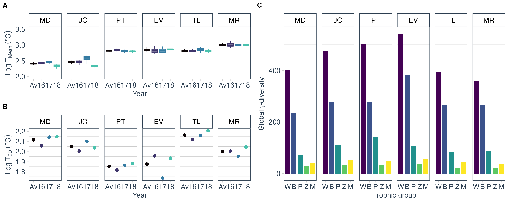

# Temperature Shapes Multi-Trophic Aquatic Biodiversity Patterns Across Space and Time

This repository contains scripts and data for analyzing how **temperature and its variability shape aquatic biodiversity across trophic levels and spatial scales**. Using environmental DNA and morphological data from freshwater mesocosms distributed across a temperature gradient, the analyses test how mean temperature and variability jointly affect α-, β-, and γ-diversity. Results show that diversity peaks at intermediate temperatures, declines at thermal extremes, and responds nonlinearly to temperature variability—highlighting that both stable and fluctuating environments can sustain high richness.  



---

## Project Structure

```
├── inputs/                                     # Input data files (diversity metrics, temperature, site info)
├── figures/                                    # Output plots and figures
├── outputs/                                    # Model summaries and tables
├── scripts/
  └── 01_visualization.Rmd                      # Data processing and visualization
  └── 02_reg_models.Rmd                         # Regression models for diversity–temperature relationships
  └── 03_linear_mixed_models.Rmd                # Linear mixed-effects models
```

---

## Requirements

All scripts are written in **R (≥4.2.0)** and rely on the following major packages:

### 🧰 General Data Handling
- `tidyverse` — data manipulation and visualization  
- `dplyr`, `tidyr`, `magrittr` — tidy workflows and data pipelines  
- `broom` — tidy summaries of model outputs  
- `tidyquant` — time and trend utilities  

### 📊 Visualization & Plotting
- `ggplot2` — core plotting  
- `ggpmisc`, `ggpubr`, `directlabels`, `gridExtra`, `viridis` — annotations, layouts, and color palettes  

### 📈 Statistical Modeling
- `lme4`, `lmerTest` — linear mixed-effects models  
- `ggeffects` — model predictions and marginal effects  
- `MuMIn` — model selection and R² estimation  

### 🧾 Reporting
- `knitr` — document rendering and figure export  

---

### 🔧 Setup

You can install all required packages using the following R code:

```r
required_packages <- c(
  "tidyverse", "dplyr", "tidyr", "magrittr", "broom", "tidyquant",
  "ggplot2", "ggpmisc", "ggpubr", "directlabels", "gridExtra", "viridis",
  "lme4", "lmerTest", "ggeffects", "MuMIn", "knitr"
)

installed <- required_packages %in% rownames(installed.packages())
if (any(!installed)) install.packages(required_packages[!installed])
```

---

# Data
Ensure the following datasets are available in the `data/` directory before running the scripts:

 - diversity_env_df.RData
 - hybrid_geo_fit_tax_res.csv

The dataset used in the current manuscript was published as part of a methods paper: Pereira, Cátia Lúcio; Gilbert, M. Thomas P.; Araújo, Miguel Bastos; Matias, Miguel Graça (2021). Fine‐tuning biodiversity assessments: A framework to pair eDNA metabarcoding and morphological approaches. Methods in Ecology and Evolution. https://doi.org/10.1111/2041-210x.13718

This Zenodo repository contains the original code used to combine eDNA and morphological data: Pereira, C. L., Gilbert, M. T. P., Araújo, M. B., & Matias, M. G. (2021). Data from: Fine-tuning biodiversity assessments: A framework to pair eDNA metabarcoding and morphological approaches. Zenodo. https://doi.org/10.5281/zenodo.5336961

This DRYAD repository contains the dataset used in the current manuscript and can be found here: Pereira, Cátia Lúcio; Gilbert, M. Thomas P.; Araújo, Miguel Bastos; Matias, Miguel Graça (2021). Data from: Fine-tuning biodiversity assessments: A framework to pair eDNA metabarcoding and morphological approaches [Dataset]. Dryad. https://doi.org/10.5061/dryad.k6djh9w71

All data files must be placed in the `data/` subfolder of the project root directory.

---

## Running the Analysis

Open and execute the scripts sequentially:

1. **`01_visualization.Rmd`**  
   Data import, cleaning, and computation of diversity metrics.  

2. **`02_reg_models.Rmd`**  
   Regression analyses assessing diversity–temperature relationships.  

3. **`03_linear_mixed_models.Rmd`**  
   Mixed-effects models testing the interaction between temperature and time.  

Scripts can be run chunk by chunk in RStudio or knitted into full reports.

---

## Outputs

- Figures exported to the `figures/` folder  
- Model summaries and tables exported to the `outputs/` folder  

---

## Authors
Cátia Pereira, Museo Nacional de Ciencias Naturales (MNCN-CSIC)

Miguel Matias, Museo Nacional de Ciencias Naturales (MNCN-CSIC)
